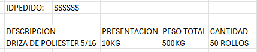
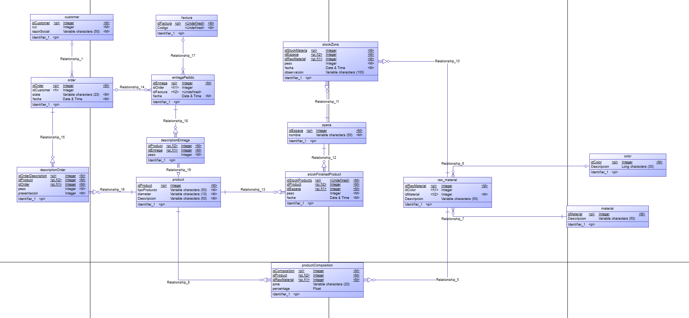

# Primer proyecto para el control de almacen, pedidos, clientes, etc
**1er Paso**
*Definir Lista de Requerimientos y reglas de negocio*
- El negocio es sobre drizas(sogas,cuerdas), que son de diferentes tipos de materiales, diametro, tipos y presentaciones.
- Los clientes se tienen que identificar con RUC Y RAZON SOCIAL( DATOS EXTRA SI ES QUE SON NECESARIOS)
- Los clientes pueden tener muchos pedidos, cada pedido tiene que especificar de esta forma
    IDPEDIDO:(numeroID)
    DESCRIPCION(TIPO, MATERIAL, DIAMETRO, PRESENTACION, PESO TOTAL, CANTIDAD DE ROLLOS(Esto se calcula mediante formulas))

- Cada pedido tiene que tener fecha de creacion
- Se tiene que mostrar todos los pedidos especificando parametros(Rango de fechas, RUC)
- Los pedidos tienen que tener un tabla que muestra el producto que se ah fabricado
- Se debe poder ingresar la materia prima en el almacen, como tambien el producto terminado
- Se toma como producto terminado a los rollos embolsados y correctamente etiquetados
- Habra usuarios con un tipo de rol(Admi,Almacen,Jefe de Produccion)
- Admi puede hacer cualquier movimiento
- Almacen puede ingresar Materia prima relacionada con guia de remision
- Jefe de produccion puede ingresar Producto terminado al Pedido, para un control de producto avanzado
- Cualquier usuario puede ingresar merma, especificando tipo de producto, color, en general
- Existen productos que tienen dentro diferentes tipos de materia prima por lo que se creara una tabla intermedia
- Se creara espacios (Almacen Materia Prima, Produccion, Merma, Almacen Producto Terminado, Entrega, Utilizable)
- Estado de pedido( Activo, En proceso, Suspendido, Finalizado)
- Se creo muchas entidades en el modelo logico, procederemos a crear la base de datos en MySQL workbench
- Imagen de modelo logico 30/07/2025

**Se agregara mas requerimientos y reglas de negocio mientras se avanza el proyecto**